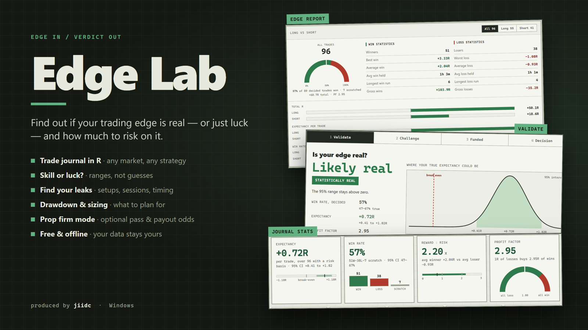

# Edge Lab

**Is your trading edge real, or just luck? And how much should you risk on it?**

Edge Lab is a trade journal and edge simulator for any strategy and any market. It measures everything
in R, tells you how sure your own record lets you be, and shows the drawdown and position size to plan
for. If you trade a funded account, an optional prop-firm mode runs your trades against your firm's
rules.

Offline and file-based: no account, no server, no telemetry. Produced by **jiidc** · MIT licensed.



## Features

**Journal**
- Trades in R: prices, or a Risk $ and P&L, or an R value directly
- Setups, entry models, sessions, quality / mistake / market-condition tags, emotions, followed-plan
- Screenshots (paste, drag or upload), MFE/MAE, planned R:R and the full run of each winner
- Multiple accounts, optional dollar layer (starting balance + what 1R is worth)

**Stats**
- **Performance**: expectancy, win rate, reward:risk and profit factor with 95% ranges; SQN, streaks,
  Kelly, deepest drawdown, equity curve, R distribution, rolling expectancy, exit efficiency
- **Target sweep**: which R:R your own record actually supports
- **Edge report**: strengths and leaks by tag, grade, setup, session and direction
- **Timing**: by entry hour, weekday, holding time, trade of the day, and time after a loss, with a
  test for whether any bucket really stands out
- **Calendar**

**Simulator**
- **Validate**: skill or luck, with the effective sample size and forward drawdown percentiles;
  **Save as image** puts the verdict and both charts on one PNG
- **Leave out**: what happens to your edge if you stop taking one kind of trade
- Drive it from sliders, or from your journal with **Use my journal**

**Prop firm mode (optional)**
- Firm rules: static / trailing / end-of-day drawdown, daily loss, targets, min days, consistency,
  fees, payout gates
- **Challenge** pass odds, **Funded** payouts and survival, **Decision** net expected value of buying in
- **Rule guard**: live distance to a bound account's drawdown floor, daily limit and target

The explanations live in the **user manual** (the **?** button in the app, or
[`guide/Edge Lab - User Manual.pdf`](guide/Edge%20Lab%20-%20User%20Manual.pdf)); the screens show the numbers.

## Try it with sample data

On an empty journal, click **Load sample journal**: 1,000 futures trades with a modest, real edge, ready
to explore. The same record is in [`samples/sample-1000-trades.json`](samples/sample-1000-trades.json)
(also attached to every release) for **Journal → Import**. Both come from one generator,
[`src/sample.ts`](src/sample.ts); `node scripts/sample.mjs` rewrites the file.

## Importing your own trades

**Import** takes an Edge Lab backup (`.json`) or a **CSV** with a header row. Only two columns are
needed: **Date** and a result, either **R** or **P&L** with a **Risk** column. Optional columns:
Exit time, Setup, Direction (long/short, buy/sell), Symbol, Account, Session, Notes, Fees. Column names
are matched loosely (`P&L`, `PnL`, `Profit` all work), a separate Time column is joined to the Date, and
comma, semicolon and tab files all read. When
every date could be day/month or month/day, the app asks instead of guessing. Re-importing the same file
with **Merge** adds nothing twice.

**Replace** never leaves you without a copy: the current journal is saved first (desktop:
`exports\before-replace-*.json`, browser: a download), and Undo puts it back. Merge keeps your existing
accounts' settings. Deleting trades or a whole account can be undone too.

## Build

Prerequisites: Node 20+, Rust stable (MSVC on Windows) and the
[Tauri prerequisites](https://tauri.app/start/prerequisites/) for your OS.

```bash
npm install
npm run tauri dev       # develop
npm run build           # unit tests + type check + web build + single-file HTML
node guide/build.cjs    # the user manual PDF (bundled into the installer)
npx tauri build         # installer for the current OS
```

The frontend also runs in any browser (IndexedDB storage): `npm run dev`, or open the single-file
build `dist/PropEdgeLab2.html`.

**Tests:** `npm test` (unit, no browser) · `npm run test:e2e` (puppeteer against the single-file build;
needs a fresh `npm run build` and Microsoft Edge) · `cd src-tauri && cargo test`.

## Stack

| Layer | Tech |
|---|---|
| Shell | Tauri 2 |
| Frontend | TypeScript + Vite, no framework, canvas charts |
| Engine | Rust Monte Carlo, with a draw-for-draw identical TypeScript fallback for browsers |
| Storage | SQLite (`journal.db`) + screenshot files |

## Your data

Everything lives in `Documents/PropEdgeLab/` (`journal.db`, `images/`, `exports/`); the folder name
is kept from the app's earlier name so existing journals keep working. **Export backup** writes one
self-contained JSON (trades + images) that **Import** restores anywhere.

## Disclaimer

An educational model, not financial advice. Firm rules change often; verify them before paying for
anything.
